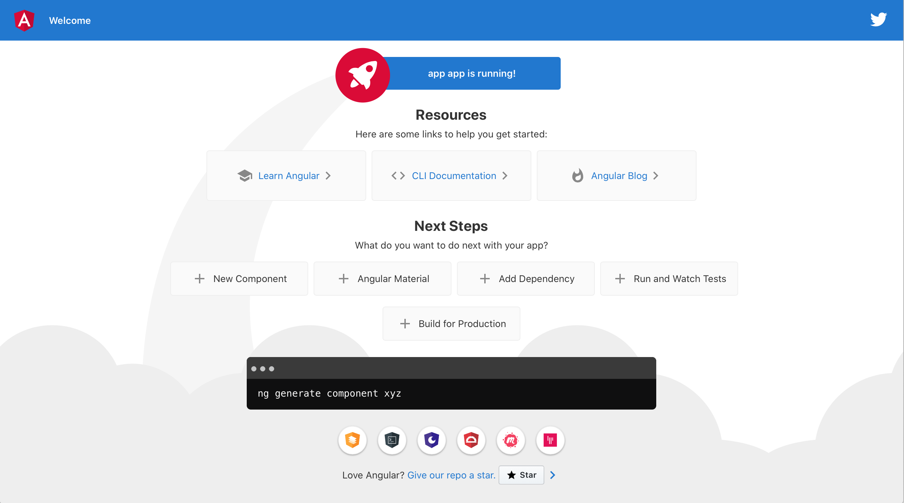
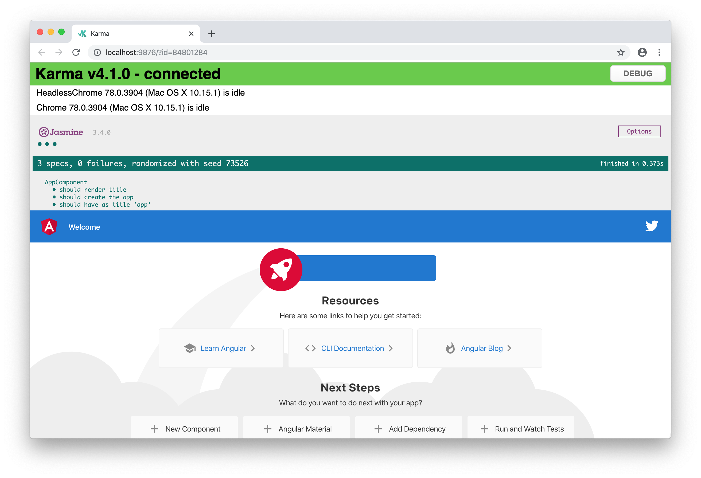
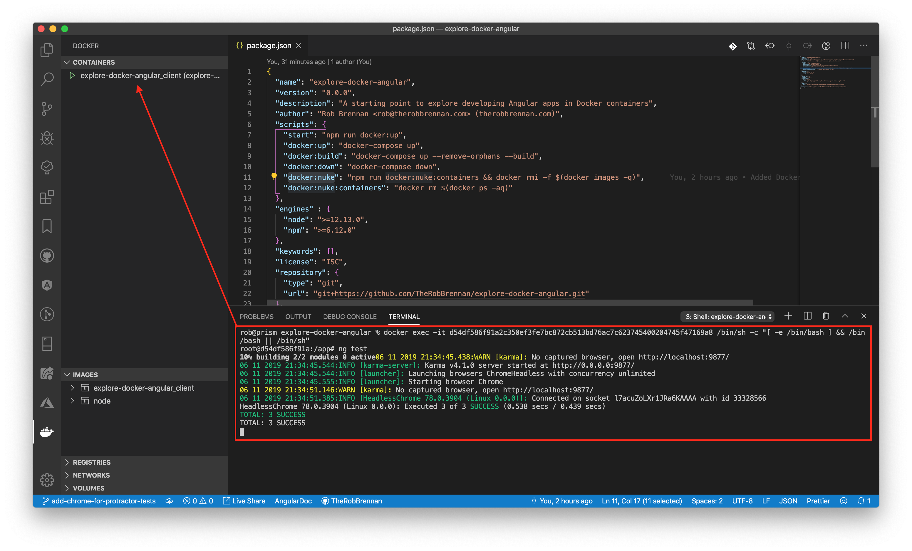

# Welcome

This project is meant to serve as a starting point for exploring [Angular](https://angular.io) using [Docker](https://www.docker.com).

## Initial setup

### Docker

The easiest way to use this repo is to have [Docker Desktop](https://www.docker.com/products/docker-desktop) installed and configured on your development machine.

### Angular CLI

Once you have Docker installed, you will need to have the latest version of the Angular CLI installed on your development machine per the [guide](https://angular.io/guide/setup-local) available on the [Angular](https://angular.io) site:

```sh
# Verify that you have Node.js v10.9.0 or later installed (https://nodejs.org)
$ node -v
v12.13.0

# Verify that the npm package manager has been installed
$ npm -v
6.12.0

# Install the Angular CLI globally
$ npm install -g @angular/cli
```

## Getting started

Once you have configured your development environment - including installing Angular globally - you can generate a new workspace and example Angular app:

```sh
# Navigate to the examples folder to create your app
$ cd examples

# Use the Angular CLI to generate a new app
$ ng new myapp
```

Once you have created your app - `myapp` in the above example - all that is left to do is:

+ Create `./path/to/myapp/Dockerfile` - feel free to copy `examples/app/Dockerfile` as an example
+ Create a `./docker-compose.myapp.yml` - feel free to copy `./docker-compose.yml` as an example
+ [OPTIONAL] Add the following scripts to `./package.json`
  + "docker:myapp:up": "docker-compose -f docker-compose.myapp.yml up",
  + "docker:myapp:up:clean": "docker-compose -f docker-compose.myapp.yml up --remove-orphans --build",
  + "docker:myapp:down": "docker-compose -f docker-compose.myapp.yml down"

## Examples

### Default app generated by ng new

The simplest example is the default app generated by `ng new app` - available in this project at `./examples/app`

Assuming you have followed the "Initial Setup" guide above, you should be able to start this example with:

```sh
$ npm start
```

Your application should be available at [http://localhost:4200](http://localhost:4200):



To verify this is working properly, make a minor modification to `examples/app/src/app/app.component.html` and verify that the page has automatically refreshed with your changes.

This app has also been enhanced to allow testing using Chrome on the local computer as well as headless Chrome within the Docker container itself by running `npm test` or `ng test`:





When you are finished, simply press CTRL+C to spin down the app:

```sh
^CGracefully stopping... (press Ctrl+C again to force)
Stopping explore-angular-app ... done
```
