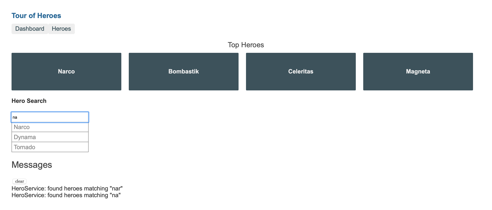

# Tour of Heroes

This example is based off the original [Tour of Heroes](https://angular.io/tutorial) tutorial on the official [Angular](https://angular.io) web site.

You should be able to start this example with:

```sh
$ npm start
```

If you have made changes to any of the Docker related files or the `package.json` for this example, please use:

```sh
$ npm run build
```

Your application should be available at [http://localhost:4200](http://localhost:4200):




To verify this is working properly, make a minor modification to `examples/app/src/app/app.component.html` and verify that the page has automatically refreshed with your changes.

This app has also been enhanced to allow testing using Chrome on the local computer as well as headless Chrome within the Docker container itself by running `npm test` or `ng test`


For [VS Code](https://code.visualstudio.com) users, this example also includes a launch configuration to debug the app natively within the IDE.


When you are finished, simply press CTRL+C to spin down the app:

```sh
^CGracefully stopping... (press Ctrl+C again to force)
Stopping explore-angular-tour-of-heroes ... done
```

Finally, you can spin down and remove the Docker container(s) for this app with:

```sh
$ npm run stop
```

This project was generated with [Angular CLI](https://github.com/angular/angular-cli) version 8.3.17.

## Development server

Run `ng serve` for a dev server. Navigate to `http://localhost:4200/`. The app will automatically reload if you change any of the source files.

## Code scaffolding

Run `ng generate component component-name` to generate a new component. You can also use `ng generate directive|pipe|service|class|guard|interface|enum|module`.

## Build

Run `ng build` to build the project. The build artifacts will be stored in the `dist/` directory. Use the `--prod` flag for a production build.

## Running unit tests

Run `ng test` to execute the unit tests via [Karma](https://karma-runner.github.io).

## Running end-to-end tests

Run `ng e2e` to execute the end-to-end tests via [Protractor](http://www.protractortest.org/).

## Further help

To get more help on the Angular CLI use `ng help` or go check out the [Angular CLI README](https://github.com/angular/angular-cli/blob/master/README.md).
